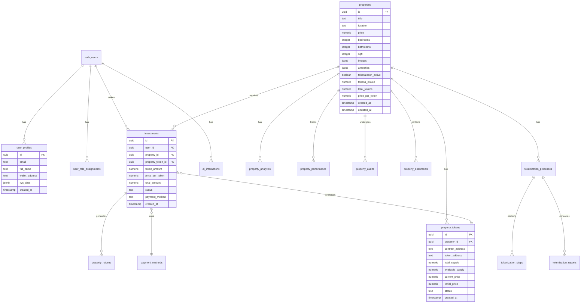

# Nexus Mint Database Schema

## Overview
This document describes the database schema for the Nexus Mint real estate tokenization platform, built on Supabase PostgreSQL.

## Entity Relationship Diagram



## Core Tables

### Properties
Central table storing real estate properties available for tokenization.

| Column | Type | Description |
|--------|------|-------------|
| id | uuid | Primary key |
| title | text | Property title/name |
| location | text | Property location |
| price | numeric | Property price in USD |
| bedrooms | integer | Number of bedrooms |
| bathrooms | integer | Number of bathrooms |
| sqft | integer | Square footage |
| images | jsonb | Array of image URLs |
| amenities | jsonb | Array of property amenities |
| tokenization_active | boolean | Whether tokenization is active |
| tokens_issued | numeric | Number of tokens currently issued |
| total_tokens | numeric | Total tokens that can be issued |
| price_per_token | numeric | Price per token in USD |

### Property Tokens
Smart contract and tokenization details for each property.

| Column | Type | Description |
|--------|------|-------------|
| id | uuid | Primary key |
| property_id | uuid | Reference to properties table |
| contract_address | text | Smart contract address |
| token_address | text | Token contract address |
| total_supply | numeric | Total token supply |
| available_supply | numeric | Available tokens for purchase |
| current_price | numeric | Current token price |
| status | text | Token status (draft, active, launched) |

### Investments
User investments in property tokens.

| Column | Type | Description |
|--------|------|-------------|
| id | uuid | Primary key |
| user_id | uuid | Reference to auth.users |
| property_id | uuid | Reference to properties table |
| token_amount | numeric | Number of tokens purchased |
| price_per_token | numeric | Price paid per token |
| total_amount | numeric | Total investment amount |
| status | text | Investment status |
| payment_method | text | Payment method used |

### AI Interactions
AI assistant conversation logs and analytics.

| Column | Type | Description |
|--------|------|-------------|
| id | uuid | Primary key |
| user_id | uuid | Reference to auth.users |
| session_id | text | Conversation session ID |
| user_message | text | User's message |
| ai_response | text | AI's response |
| intent_detected | text | Detected user intent |
| confidence_score | numeric | AI confidence level |
| recommendation_type | text | Type of recommendation given |

### Tokenization Processes
Tracks the tokenization workflow for properties.

| Column | Type | Description |
|--------|------|-------------|
| id | uuid | Primary key |
| property_id | uuid | Reference to properties table |
| user_id | uuid | Process initiator |
| status | text | Process status |
| current_step | text | Current workflow step |
| progress_percentage | integer | Completion percentage |
| steps_completed | jsonb | Array of completed steps |

## Security & Access Control

### Row Level Security (RLS)
All tables have RLS enabled with policies based on:
- User ownership (users can only access their own data)
- Role-based access (admins can access all data)
- Public data (some property information is publicly viewable)

### User Roles
Implemented via `user_role_assignments` table with roles:
- `admin`: Full system access
- `compliance_officer`: Audit and compliance access
- `property_manager`: Property management access
- `investor`: Standard user access

### Key RLS Policies

#### Properties
```sql
-- Public properties are viewable by everyone
CREATE POLICY "Public properties are viewable by everyone" 
ON properties FOR SELECT 
USING (is_active = true);
```

#### Investments
```sql
-- Users can view own investments
CREATE POLICY "Users can view own investments" 
ON investments FOR SELECT 
USING (user_id = auth.uid());
```

#### AI Interactions
```sql
-- Users can view own AI interactions
CREATE POLICY "Users can view own AI interactions" 
ON ai_interactions FOR SELECT 
USING (auth.uid() = user_id);
```

## Materialized Views

### Investment Opportunities
Pre-computed view for property investment opportunities.
```sql
CREATE MATERIALIZED VIEW investment_opportunities_mv AS
SELECT 
  p.id as property_id,
  p.title,
  p.city,
  p.property_type,
  p.price_per_token,
  COUNT(i.id) as total_investors,
  SUM(i.total_amount) as total_invested,
  (SUM(i.total_amount) / p.funding_target * 100) as funding_percentage
FROM properties p
LEFT JOIN investments i ON p.id = i.property_id
WHERE p.is_active = true
GROUP BY p.id;
```

### Property Market Insights
Market analytics for properties.
```sql
CREATE MATERIALIZED VIEW property_market_insights_mv AS
SELECT 
  p.id as property_id,
  p.title,
  p.price,
  p.price_per_token,
  p.tokens_issued,
  (p.tokens_issued / p.total_tokens * 100) as funding_percentage,
  AVG(i.price_per_token) as avg_investor_price
FROM properties p
LEFT JOIN investments i ON p.id = i.property_id
GROUP BY p.id;
```

## Indexes
Key indexes for performance:
- `properties_location_idx` on properties(location)
- `investments_user_property_idx` on investments(user_id, property_id)
- `ai_interactions_user_session_idx` on ai_interactions(user_id, session_id)
- `tokenization_processes_status_idx` on tokenization_processes(status)

## Storage Buckets
- `property-images`: Public property photos
- `kyc-documents`: Private KYC documents
- `user-avatars`: Public user profile pictures
- `property-media`: Public property videos/documents
- `investment-documents`: Private investment agreements
- `chat-attachments`: Private chat file uploads

## Functions
Key database functions:
- `has_role(user_id, role)`: Check user permissions
- `can_access_property(user_id, property_id)`: Property access control
- `calculate_investment_fees(amount, fee_type)`: Fee calculations
- `refresh_analytics_views()`: Update materialized views

## Triggers
- `handle_new_user()`: Auto-create user profile on signup
- `log_data_modification()`: Audit trail for data changes
- `update_updated_at_column()`: Auto-update timestamps